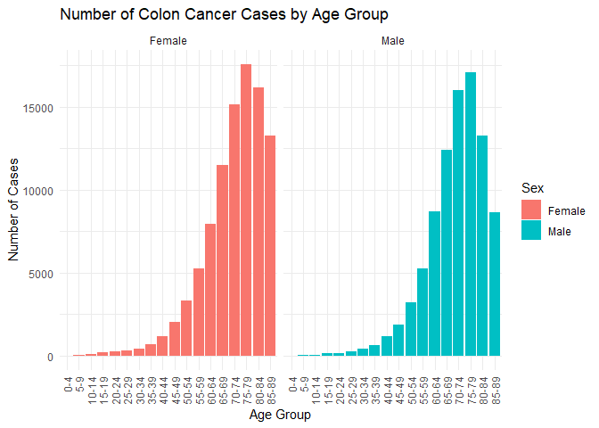
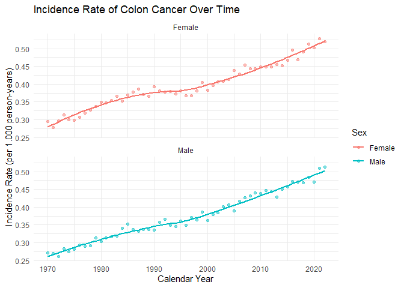
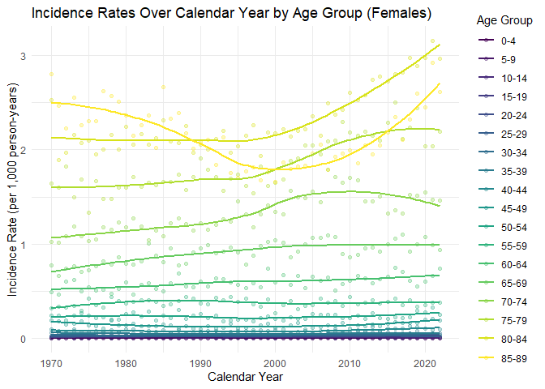
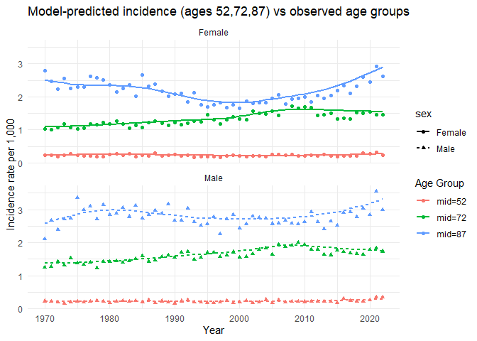

Biostatistics 1 - Assignment 1
================
Group 3: William Fleury Dziuk, Galya Gadzhalova, Chen Ma,
Afroditi-Iliana Zotou
2025-11-20

## Introduction

Within this assignment we will analyse data on incident cases of colon
cancer in Sweden, across calendar year as well as by age and sex. The
data contain the number of colon cancer cases and demographics of the
population in Sweden (age, year and sex on July 1st). The purpose is to
describe the incidence of colon cancer in Sweden, especially the
incidence pattern across calendar year.

## Libraries

``` r
library(ggplot2)
library(RColorBrewer)
library(scales)
library(mgcv)
```

    ## 载入需要的程序包：nlme

    ## This is mgcv 1.9-1. For overview type 'help("mgcv-package")'.

``` r
library(dplyr)
```

    ## 
    ## 载入程序包：'dplyr'

    ## The following object is masked from 'package:nlme':
    ## 
    ##     collapse

    ## The following objects are masked from 'package:stats':
    ## 
    ##     filter, lag

    ## The following objects are masked from 'package:base':
    ## 
    ##     intersect, setdiff, setequal, union

## 1

**Task:** Read in the file on number of colon cancer cases (the file
cases.tsv) and make sure that you understand the variables included.
Create a graph showing the number of cases by age group and sex.
Describe what you can conclude from the graph.

**Answer:**

``` r
#Read in Table
cases <- read.table("cases-1.tsv")

#Need to turn first row into headers
colnames(cases) <- cases[1, ]
cases <- cases[-1, ]
```

``` r
#Clean Up Data Frame Column Types

cases$agegroup <- factor(
  cases$agegroup,
  levels = c("0-4", "5-9", "10-14", "15-19", "20-24", "25-29", "30-34", "35-39", "40-44", "45-49", "50-54", "55-59", "60-64", "65-69", "70-74", "75-79", "80-84", "85-89"),
  ordered = TRUE
)

cases$sex <- factor(cases$sex)
cases$year <- as.numeric(cases$year)
cases$n <- as.numeric(cases$n)
```

``` r
 #Graph showing the number of cases by age group and sex.
ggplot(cases, aes(x = agegroup, y = n, fill = sex)) +
  geom_col() +
  facet_wrap(~ sex) +
  theme_minimal() +
  labs(
    title = "Number of Colon Cancer Cases by Age Group",
    fill = "Sex",
    x = "Age Group",
    y = "Number of Cases"
  ) +
  theme(axis.text.x = element_text(angle = 90, hjust = 1, vjust = 0.5))
```

<!-- -->

In our data set we have the following variables:

## 2

**Task:** Obtain the total number of cases in each calendar year by
males and females. Create graphs showing the number of cases over
calendar years, separately for males and females. Describe what you can
conclude from the graphs.

**Answer:**

``` r
#Obtain the total number of cases in each calendar year by males and females
cases_by_year <- aggregate(n ~ year + sex, data = cases, sum)

#Create graphs showing the number of cases over calendar years,
#separately for males and females
ggplot(cases_by_year, aes(x = year, y = n, color = sex)) +
  geom_line() +
  geom_point() +
  labs(
    title = "Number of Cases over Calendar Years",
    color = "Sex",
    x = "Year",
    y = "Cases") +
  theme_minimal()
```

<!-- -->

## 3

**Task:** Read in the file on number of persons at risk (the file
population.tsv). Make sure that you understand the variables included.
Create graphs that illustrate the population size over age groups and
calendar year si multaneously, separately by males and females.

**Answer:**

``` r
#Read in the table
population <- read.table("population-1.tsv")

#Need to turn first row into headers
colnames(population) <- population[1, ]
population <- population[-1, ]
```

``` r
#Clean up the Dataframe
population$agegroup <- factor(
  population$agegroup,
  levels = c("0-4", "5-9", "10-14", "15-19", "20-24", "25-29", "30-34", 
             "35-39", "40-44", "45-49", "50-54", "55-59", "60-64", "65-69", 
             "70-74", "75-79", "80-84", "85-89"),
  ordered = TRUE
)

population$sex <- factor(population$sex)
population$year <- as.numeric(population$year)
population$n_pop <- as.numeric(population$n_pop)
```

``` r
#Create graphs that illustrate the population size over age groups 
#and calendar year simultaneously, separately by males and females.

ggplot(population, aes(x = year, y = n_pop, color = agegroup)) +
  geom_line() +
  #geom_point() +
  facet_wrap(~ sex, ncol = 1) +
  scale_y_continuous(labels = label_number(scale = 1e-3,)) +
  labs(
    title = "Swedish Population by Year and Age Group",
    color = "Age Group",
    x = "Year",
    y = "Population (In Thousands)") +
  theme_minimal()
```

<!-- -->

## 4

**Task:** Merge the information on number of cases and the number of
persons at risk in each year, for each age group and sex. Does the
population file include the same age groups and calendar years as the
file including the number of cases? Also create a separate data frame
with the total number of cases and the total population size in each
calendar year by males and females.

**Answer:**

``` r
#Merged information on number of cases and the number of persons at risk in each year, 
#for each age group and sex. 
merged_df <- merge(cases, population, by = c("agegroup", "year", "sex"))

#Separate data frame with the total number of cases 
#and the total population size in each calendar year by males and females.

cases_sum <- aggregate(n ~ year + sex, data = merged_df, sum)
population_sum <- aggregate(n_pop ~ year + sex, data = merged_df, sum)
summary_df <- merge(cases_sum, population_sum, by = c("year", "sex"))
```

## 5

**Task:** Create a new variable for the incidence rate of colon cancer
by dividing the number of cases with the population size. Do this for
both the data including all the age groups and the data with the total
number of cases per year and sex. Describe shortly what an incidence
rate is, and your thoughts on if this is an appropriate way of
calculating an incidence rate.

**Answer:** We define Incidence rate (IR) as
$\text{Incidence Rate} = \frac{\text{Number of new colon cancer cases}}{\text{Population size}}$

We also calculated the rate per 1.000 person-years to easier interpret
the results.

$\text{Incidence Rate per }1.000=1.000 \times \frac{\text{Number of new colon cancer cases}}{\text{Population size}}$

``` r
# Create incidence rates

# Age incidence rates (agegroup × year × sex)
merged_df$Incidencerate <- merged_df$n / merged_df$n_pop
merged_df$Incidencerate_per1000 <- merged_df$Incidencerate * 1000

# Summary incidence rates (year × sex totals)
summary_df$Incidencerate <- summary_df$n / summary_df$n_pop
summary_df$Incidencerate_per1000 <- summary_df$Incidencerate * 1000

# Example rows 
cat("\n Example rows (summary_df) \n")
```

    ## 
    ##  Example rows (summary_df)

``` r
print(summary_df[sample(nrow(summary_df), 5),
                 c("year", "sex", "n", "n_pop", "Incidencerate",
                   "Incidencerate_per1000")])
```

    ##    year    sex    n   n_pop Incidencerate Incidencerate_per1000
    ## 46 1992   Male 1571 4294585  0.0003658095             0.3658095
    ## 91 2015 Female 2300 4920051  0.0004674748             0.4674748
    ## 51 1995 Female 1700 4471425  0.0003801920             0.3801920
    ## 23 1981 Female 1463 4204411  0.0003479679             0.3479679
    ## 32 1985   Male 1454 4127110  0.0003523046             0.3523046

``` r
cat("\n Example rows (merged_df) \n")
```

    ## 
    ##  Example rows (merged_df)

``` r
print(merged_df[sample(nrow(merged_df), 5),
                c("agegroup", "year", "sex", "n", "n_pop","Incidencerate",
                  "Incidencerate_per1000")])
```

    ##      agegroup year    sex   n  n_pop Incidencerate Incidencerate_per1000
    ## 914     45-49 2002   Male  28 297221  9.420599e-05            0.09420599
    ## 1623    75-79 1986 Female 302 181596  1.663032e-03            1.66303223
    ## 99        0-4 2019 Female   0 292151  0.000000e+00            0.00000000
    ## 941     45-49 2016 Female  55 324719  1.693772e-04            0.16937722
    ## 1283    60-64 1975 Female 133 246478  5.396019e-04            0.53960191

From the lecture notes “Introduction to Epidimiology” by Adina Feldman,
we define the Incidence rate (IR) as the number of new cases of the
outcome divided by the total person-time at risk, for a specific
follow-up period. It is a factor used to measure individuals who are
newly diagnosed with a disease during a specified period of time.

Theoretically, our definition used to calculate the Incidence rate
matches Feldman’s definition since both measure new cases relative to
the population at risk. However, our definition is a simplified version
of the formal one, since we assumed the population size to be an
approximation for person-time In our case, the exact person-time is not
available and we can also consider that the population does not
dramatically change over the year. Hence, we can conclude that this is
this is a valid way of calculating an incidence rate where detailed
follow‑up is not available.

## 6

**Task:** Plot the incidence rate of colon cancer over calendar time and
apply a smoother, separately by males and females (do this for the
incidence rate based on the total number of cases and the total
population size). Describe what you can conclude from the graphs

**Answer:**

``` r
# Plot the Incidence Rate 
ggplot(summary_df, aes(x = year, y = Incidencerate_per1000, color = sex)) +
  geom_point(alpha = 0.5) +                    # show actual data points
  geom_smooth(method = "loess", se = FALSE) +  # smoother curve
  facet_wrap(~ sex, ncol = 1) +                # separate for males/females
  theme_minimal() +
  labs(
    title = "Incidence Rate of Colon Cancer Over Time",
    x = "Calendar Year",
    y = "Incidence Rate (per 1.000 person-years)",
    color = "Sex"
  )
```

    ## `geom_smooth()` using formula = 'y ~ x'

<!-- -->

From the above graph, we notice that the Incidence Rate is steadily
increasing over time for both males and females and it almost doubles in
the span of 50 years. This implies that the diagnosis of colon cancer
became more common and accessible over the decades.Additionally, the
Incidence rates are consistently higher for males meaning that for the
same age period, men have a higher chance of being diagnosed with colon
cancer than females. This means that the trends are similar for both
sexes exhibit but at different absolute levels. As for the LOESS
smoother, the curved line, it clearly shows a long-term upward trend by
ignoring minor fluctuations.

Confidence bands, as shown by the shaded areas, are relatively narrow,
indicating a statistically robust trend. In a more practical
perspective, we can interpret that there have been major improvements in
screening and diagnosing colon cancer over the past decades and
awareness has been raised encouraging testing especially for men.

## 7

**Task:** Since there is a lot of random variation of the incidence rate
from year to year, we can use a regression model to get smooth estimates
of the pattern of the incidence rate across calendar year. Fit a
suitable Poisson model with the total number of cases as dependent
variable, using the population size as an offset, and calendar year and
sex as independent variables.

**Answer:**

We will fit a Poisson Regression model for the dependent variable $Y$
that represents the number of new colon cancer cases. We assume:
$Y_i \sim \text{Poisson}(\lambda_i)$, where $\lambda_i$ is the expected
number of cases for observation $i$.

The model links predictors calendar year and sex to the expected count
via a log-linear model:

$$
\log(\lambda) = \log(\text{population}) + \beta_{0} + \beta_{1} \cdot \text{year} + \beta_{2} \cdot \text{sex}
$$

``` r
# Fit Poisson Regression Model
poisson_model <- glm(
  n ~ year + sex,                  # independent variables
  offset = log(n_pop),            # log of population size as offset
  family = poisson(link = "log"), # Poisson model
  data = summary_df
)

# View model summary
summary(poisson_model)
```

    ## 
    ## Call:
    ## glm(formula = n ~ year + sex, family = poisson(link = "log"), 
    ##     data = summary_df, offset = log(n_pop))
    ## 
    ## Coefficients:
    ##               Estimate Std. Error z value Pr(>|z|)    
    ## (Intercept) -2.969e+01  3.071e-01  -96.68   <2e-16 ***
    ## year         1.094e-02  1.536e-04   71.25   <2e-16 ***
    ## sexMale     -5.592e-02  4.658e-03  -12.01   <2e-16 ***
    ## ---
    ## Signif. codes:  0 '***' 0.001 '**' 0.01 '*' 0.05 '.' 0.1 ' ' 1
    ## 
    ## (Dispersion parameter for poisson family taken to be 1)
    ## 
    ##     Null deviance: 5505.07  on 105  degrees of freedom
    ## Residual deviance:  222.81  on 103  degrees of freedom
    ## AIC: 1211.4
    ## 
    ## Number of Fisher Scoring iterations: 3

*Parameters in the model that can be estimated:* $\beta_0$, $\beta_1$,
and $\beta_2$.

*Estimates that we get:* $\beta_0 = -29.69$, $\beta_1 = 0.01094$,
$\beta_2 = -0.05592$.

The Poisson regression model is defined as:

$$
\log(\lambda) = \log(\text{population}) -29.69 + 0.01094 \cdot \text{year} - 0.05592 \cdot \text{sex} 
$$

where $\lambda$ is the expected number of colon cancer cases and sex is
coded as 1 for males and 0 for females.

*Interpretation of estimates:*

The value $\beta_0 = -29.69$ represents the baseline log incidence rate
for females in year 0.

While year 0 is not meaningful directly, this intercept anchors the
model.

The value $\beta_1 = 0.01094$ means that for each additional calendar
year, the log incidence rate increases by 0.01094. The relative
exponential value $e^{0.01094} \approx 1.011$ means that the incidence
rate increases by approximately $1.1\%$ per year when considering sex
constant.

The value $\beta_2 = -0.05592$ suggests that males have a lower log
incidence rate than females. The relative exponential value
$e^{-0.05592} \approx 0.9456$ means that the incidence rate for males is
about 5.4% lower than for females.

As for the statistical significance, we see that all coefficients have
very small p-values ($< 2 \times 10^{-16}$), indicating strong
statistical significance. We can reject the null hypothesis that year
and sex have no effect on incidence rate.

The differnece between the Null and the Residual deviance suggests that
the model explains well the variation in the data. The value AIC is also
relatively low which is also an indicator for a good model fit.

The Poisson regression model with the total number of cases as dependent
variable, using the population size as an offset, and calendar year and
sex as independent variables fits the data well and provides a valid
estimate of incidence trends across calendar years. It shows that colon
cancer incidence rates in Sweden have increased steadily over time and
that females have slightly higher rates than males when adjusted for
population size.

## 8

**Task description:** Based on the model output from above, what is the
incidence rate in 1970 among males and females? Based on the model
output from above, what is the incidence rate in 2020 among males and
females? What assumptions have you made regarding how the incidence rate
changes over calendar years and what the difference is between males and
females?

**Answer:**

Using the fitted Poisson model in Task 7, the incidence rate is given
by:

$$
\log(IR) = \beta_0 + \beta_1 \cdot \text{year} + \beta_2 \cdot \text{sex}
$$

Therefore, the following calculations can be made:

**Incidence rate in 1970:**

Females (sex = 0):

$$
\log(IR) = -29.69 + 0.01094 \cdot 1970
$$

$$
\log(IR) = -8.142
$$

$$
IR_{\text{female, 1970}} = e^{-8.142} = 0.00029
$$

Per 1,000:

$$
IR_{\text{female, 1970}} \times 1000 \approx 0.29
$$

Males (sex = 1):

$$
\log(IR) = -29.69 + 0.01094 \cdot 1970 - 0.05592
$$

then,

$$
\log(IR) =  -8.198
$$

$$
IR_{\text{male, 1970}} = e^{-8.198} = 0.000274
$$

Per 1,000:

$$
IR_{\text{male, 1970}} \times 1000 \approx 0.274
$$

Similarly, the incidence rate for the year 2020 is calculated, with the
only change being that the term $\beta_1 \cdot 1970$ has been replaced
with $\beta_1 \cdot 2020$.

A summary table of the model-based incidence rates (per 1,000
person-years) is presented below:

| Year | Sex    | Incidence Rate (per 1,000) |
|------|--------|----------------------------|
| 1970 | Female | 0.29                       |
| 1970 | Male   | 0.27                       |
| 2020 | Female | 0.52                       |
| 2020 | Male   | 0.49                       |

These results indicate that the model predicts a steady increase in
incidence over time for both sexes between 1970 and 2020.

The following assumptions could be made based on the model:

- The coefficient for calendar year is $\beta_1 = 0.01094$. When it is
  normalized, $e^{0.01094} \approx 1.011$, it could be concluded that
  the incidence rate increases by about 1.1% per year. So the model
  assumes a steady and constant yearly increase in incidence over time.

- In the model the variable sex is a binary variable which takes values
  0 or 1. So we assume that the relative difference between males and
  females is constant across the person years.

Intrepretation:

The coefficient infront the sex variable is:

$$
\beta_2 = -0.05592
$$

Then, the value should be normalised, when the exponential is calculated

$$
e^{-0.05592} \approx 0.9456
$$

This value (0.9456) represents the ratio of the male incidence rate to
the female incidence rate.

To find the percentage difference, we subtract 1:

$$
0.9456 - 1 = -0.0544
$$

Which means that males have about 5.4% lower incidence than females.

## 9

**Task description:**

Create a graph of incidence rates over calendar year by sex and age
group, and apply smoothers, what can you conclude?

**Answer:**

``` r
#Two separate incidence rate graphs. First one only for females and the second
#one for males.

female_df <- subset(merged_df, sex == "Female")

ggplot(female_df, aes(x = year,
y = Incidencerate_per1000,
color = agegroup)) +
geom_point(alpha = 0.3) +
geom_smooth(se = FALSE, method = "loess", linewidth = 0.9) +
theme_minimal() +
labs(
title = "Incidence Rates Over Calendar Year by Age Group (Females)",
x = "Calendar Year",
y = "Incidence Rate (per 1,000 person-years)",
color = "Age Group"
)
```

    ## `geom_smooth()` using formula = 'y ~ x'

<!-- -->

``` r
male_df <- subset(merged_df, sex == "Male")

ggplot(male_df, aes(x = year,
y = Incidencerate_per1000,
color = agegroup)) +
geom_point(alpha = 0.3) +
geom_smooth(se = FALSE, method = "loess", linewidth = 0.9) +
theme_minimal() +
labs(
title = "Incidence Rates Over Calendar Year by Age Group (Males)",
x = "Calendar Year",
y = "Incidence Rate (per 1,000 person-years)",
color = "Age Group")
```

    ## `geom_smooth()` using formula = 'y ~ x'

<!-- -->

``` r
#One combined graph of incidence rates over time. The dashed line is for males
#and the continuous line is for females.

ggplot(merged_df, aes(x = year,y = Incidencerate_per1000, color = agegroup,
                      linetype = sex)) + geom_point(alpha = 0.3) +
  geom_smooth(se = FALSE, method = "loess", linewidth = 0.9) + theme_minimal() + 
  labs(
title = "Incidence Rates Over Calendar Year by Sex and Age Group",
x = "Calendar Year",
y = "Incidence Rate (per 1,000 person-years)",
color = "Age Group",
linetype = "Sex"
)
```

    ## `geom_smooth()` using formula = 'y ~ x'

<!-- -->

**Interpretation of the results:**

Across both groups (Female and Male) the the incidence rate of colon
cancer increases with age. The oldest age group reports the highest
incidence rates while the youngest age group reports stable, around the
zero, rates. Furthermore, the trend over the calendar years is upward,
meaning that the incidence rate increases over time especially among the
middle-aged groups and older individuals. In contrast younger groups
shows very little or no change across the years. Overall, the patterns
for males and females are similar, with upward trend over time. Also
colon cancer incidence rises over time in the older age groups.

## 10

**Task description:**

Since colon cancer is more common in older age groups, and the age dis-
tribution has changed in the population, we want to also adjust for age.
Again fit a suitable Poisson model, but this time with the age-specific
number of cases as the dependent variable, and age-specific population
size as offset, and calendar year, age group and sex as independent
vari- ables. Make sure to not assume that the pattern across calendar
year is the same for males and females and across age groups. Based on
the model output from above, what is the incidence rate in 1970 in age
group 70-74 among males and females? Based on the model output from
above, what is the incidence rate in 2020 in age group 70-74 among males
and females?

**Answer:**

Suitable model for this task is:

$$
\log(\lambda_{i,a,s}) = \log(\text{population}_{i,a,s}) + \beta_0 + \beta_1 \cdot \text{year}_i + \beta_2 \cdot \text{sex}_s + \beta_3 \cdot \text{agegroup}_a + \text{(two-way interactions)} + \text{(three-way interactions)}.
$$

**Description of the variables in the model:**

- `n`: age–sex–year specific number of colon cancer cases (dependent
  variable).
- `n_pop`: population size in the same age–sex–year group, also
  `log(n_pop)` as an offset.
- The formula `year * sex * agegroup` includes all main effects, all
  two-way interactions and the three-way interaction, allowing each
  sex–age group to have its own time trend.

``` r
#Fit Poisson model with age-specific counts
#    - Dependent variable: n (number of cases)
#    - Offset: log(n_pop) (age-specific population size)
#    - Predictors: year, sex, agegroup + all interactions
poisson_age_model <- glm(
  n ~ year * sex * agegroup,
  offset = log(n_pop),
  family = poisson(link = "log"),
  data = merged_df
)

summary(poisson_age_model)
```

    ## 
    ## Call:
    ## glm(formula = n ~ year * sex * agegroup, family = poisson(link = "log"), 
    ##     data = merged_df, offset = log(n_pop))
    ## 
    ## Coefficients:
    ##                            Estimate Std. Error z value Pr(>|z|)  
    ## (Intercept)              -1.491e+01  7.421e+00  -2.010   0.0445 *
    ## year                      2.749e-03  3.715e-03   0.740   0.4592  
    ## sexMale                  -1.574e+01  1.165e+01  -1.352   0.1765  
    ## agegroup.L               -1.070e+01  5.090e+01  -0.210   0.8336  
    ## agegroup.Q                8.288e+00  5.815e+01   0.143   0.8867  
    ## agegroup.C                1.719e+00  5.782e+01   0.030   0.9763  
    ## agegroup^4               -1.494e+00  5.236e+01  -0.029   0.9772  
    ## agegroup^5                3.211e+01  4.413e+01   0.728   0.4668  
    ## agegroup^6               -1.864e+01  3.504e+01  -0.532   0.5947  
    ## agegroup^7                1.803e+01  2.651e+01   0.680   0.4964  
    ## agegroup^8               -1.269e+01  1.942e+01  -0.653   0.5134  
    ## agegroup^9                7.070e+00  1.407e+01   0.503   0.6153  
    ## agegroup^10               3.938e+00  1.038e+01   0.380   0.7043  
    ## agegroup^11              -2.744e+00  8.042e+00  -0.341   0.7330  
    ## agegroup^12              -1.238e+00  6.635e+00  -0.187   0.8519  
    ## agegroup^13              -1.395e-02  5.824e+00  -0.002   0.9981  
    ## agegroup^14               3.871e-01  5.391e+00   0.072   0.9428  
    ## agegroup^15               5.082e+00  5.052e+00   1.006   0.3145  
    ## agegroup^16              -5.382e+00  4.578e+00  -1.176   0.2398  
    ## agegroup^17               7.494e+00  3.880e+00   1.931   0.0534 .
    ## year:sexMale              7.815e-03  5.814e-03   1.344   0.1789  
    ## year:agegroup.L           1.087e-02  2.548e-02   0.427   0.6696  
    ## year:agegroup.Q          -5.223e-03  2.911e-02  -0.179   0.8576  
    ## year:agegroup.C          -2.905e-04  2.894e-02  -0.010   0.9920  
    ## year:agegroup^4          -2.303e-04  2.621e-02  -0.009   0.9930  
    ## year:agegroup^5          -1.550e-02  2.209e-02  -0.702   0.4828  
    ## year:agegroup^6           9.046e-03  1.754e-02   0.516   0.6061  
    ## year:agegroup^7          -9.051e-03  1.328e-02  -0.682   0.4954  
    ## year:agegroup^8           6.407e-03  9.726e-03   0.659   0.5101  
    ## year:agegroup^9          -3.564e-03  7.050e-03  -0.506   0.6132  
    ## year:agegroup^10         -2.003e-03  5.200e-03  -0.385   0.7002  
    ## year:agegroup^11          1.415e-03  4.031e-03   0.351   0.7256  
    ## year:agegroup^12          5.889e-04  3.324e-03   0.177   0.8594  
    ## year:agegroup^13          1.621e-05  2.916e-03   0.006   0.9956  
    ## year:agegroup^14         -1.750e-04  2.699e-03  -0.065   0.9483  
    ## year:agegroup^15         -2.567e-03  2.529e-03  -1.015   0.3101  
    ## year:agegroup^16          2.704e-03  2.291e-03   1.180   0.2379  
    ## year:agegroup^17         -3.747e-03  1.942e-03  -1.929   0.0537 .
    ## sexMale:agegroup.L        8.526e+01  7.974e+01   1.069   0.2850  
    ## sexMale:agegroup.Q       -4.933e+01  9.076e+01  -0.543   0.5868  
    ## sexMale:agegroup.C        3.353e+01  8.997e+01   0.373   0.7094  
    ## sexMale:agegroup^4       -2.519e+01  8.148e+01  -0.309   0.7573  
    ## sexMale:agegroup^5        2.634e-01  6.902e+01   0.004   0.9970  
    ## sexMale:agegroup^6        5.305e+00  5.547e+01   0.096   0.9238  
    ## sexMale:agegroup^7       -1.831e+01  4.279e+01  -0.428   0.6688  
    ## sexMale:agegroup^8        2.249e+01  3.207e+01   0.701   0.4831  
    ## sexMale:agegroup^9       -1.887e+01  2.372e+01  -0.796   0.4263  
    ## sexMale:agegroup^10       1.755e+01  1.765e+01   0.994   0.3200  
    ## sexMale:agegroup^11      -2.404e+01  1.354e+01  -1.776   0.0757 .
    ## sexMale:agegroup^12       2.685e+01  1.093e+01   2.457   0.0140 *
    ## sexMale:agegroup^13      -2.098e+01  9.351e+00  -2.244   0.0248 *
    ## sexMale:agegroup^14       1.151e+01  8.367e+00   1.376   0.1690  
    ## sexMale:agegroup^15      -5.481e+00  7.546e+00  -0.726   0.4676  
    ## sexMale:agegroup^16       2.050e+00  6.672e+00   0.307   0.7586  
    ## sexMale:agegroup^17      -4.873e-01  5.587e+00  -0.087   0.9305  
    ## year:sexMale:agegroup.L  -4.207e-02  3.981e-02  -1.057   0.2906  
    ## year:sexMale:agegroup.Q   2.462e-02  4.531e-02   0.543   0.5868  
    ## year:sexMale:agegroup.C  -1.685e-02  4.491e-02  -0.375   0.7074  
    ## year:sexMale:agegroup^4   1.275e-02  4.068e-02   0.313   0.7539  
    ## year:sexMale:agegroup^5  -3.243e-04  3.446e-02  -0.009   0.9925  
    ## year:sexMale:agegroup^6  -2.524e-03  2.770e-02  -0.091   0.9274  
    ## year:sexMale:agegroup^7   9.159e-03  2.137e-02   0.429   0.6682  
    ## year:sexMale:agegroup^8  -1.124e-02  1.602e-02  -0.702   0.4828  
    ## year:sexMale:agegroup^9   9.410e-03  1.186e-02   0.794   0.4274  
    ## year:sexMale:agegroup^10 -8.746e-03  8.828e-03  -0.991   0.3218  
    ## year:sexMale:agegroup^11  1.202e-02  6.774e-03   1.774   0.0761 .
    ## year:sexMale:agegroup^12 -1.342e-02  5.468e-03  -2.455   0.0141 *
    ## year:sexMale:agegroup^13  1.052e-02  4.679e-03   2.248   0.0246 *
    ## year:sexMale:agegroup^14 -5.801e-03  4.187e-03  -1.385   0.1659  
    ## year:sexMale:agegroup^15  2.768e-03  3.776e-03   0.733   0.4635  
    ## year:sexMale:agegroup^16 -1.035e-03  3.338e-03  -0.310   0.7566  
    ## year:sexMale:agegroup^17  2.163e-04  2.795e-03   0.077   0.9383  
    ## ---
    ## Signif. codes:  0 '***' 0.001 '**' 0.01 '*' 0.05 '.' 0.1 ' ' 1
    ## 
    ## (Dispersion parameter for poisson family taken to be 1)
    ## 
    ##     Null deviance: 406971.1  on 1907  degrees of freedom
    ## Residual deviance:   2680.5  on 1836  degrees of freedom
    ## AIC: 11932
    ## 
    ## Number of Fisher Scoring iterations: 6

``` r
#Creating new data for predictions for age group 70-74 in 1970 and 2020 from
#the model above.
newdata_70_74 <- data.frame(
  year     = c(1970, 1970, 2020, 2020),
  sex      = factor(c("Female", "Male", "Female", "Male"),
                    levels = levels(merged_df$sex)),
  agegroup = factor(rep("70-74", 4),
                    levels = levels(merged_df$agegroup)),
   #Set n_pop to 1 so predicted value is a rate.
  n_pop    = 1 
)

#Predicted incidence rates per person-year.
newdata_70_74$IR <- predict(
  poisson_age_model,
  newdata = newdata_70_74,
  type = "response"
)

#Convert to incidence per 1,000 person-years
newdata_70_74$IR_per_1000 <- newdata_70_74$IR * 1000

newdata_70_74
```

    ##   year    sex agegroup n_pop          IR IR_per_1000
    ## 1 1970 Female    70-74     1 0.001076171    1.076171
    ## 2 1970   Male    70-74     1 0.001375641    1.375641
    ## 3 2020 Female    70-74     1 0.001566005    1.566005
    ## 4 2020   Male    70-74     1 0.001822081    1.822081

The results show that:

- Incidence rates are higher for males than for females in both years.
- Incidence rates are higher in 2020 than in 1970 for both sexes.

## 11

**Task:** If you have not already done so, refit the model above using
splines for the effect of calendar year and age group (use the mid point
of each age group), and also make sure to not assume that the pattern
across calendar year is the same across age and sex. Create graphs
showing the incidence rate across calendar time for males and females at
ages 52, 72 and 87. Compare with the observed values for age group
50-54, 70-74 and 85-89 from previously.

**Answer:**

``` r
if (!"age_mid" %in% names(merged_df)) {
  merged_df <- merged_df %>%
    mutate(
      age_start = as.numeric(sub("^(\\d+)-.*$", "\\1", agegroup)),
      age_end   = as.numeric(sub("^.*-(\\d+)$", "\\1", agegroup)),
      age_mid   = (age_start + age_end) / 2
    ) %>% select(-age_start, -age_end)
}


if (!"Incidencerate" %in% names(merged_df)) {
  merged_df <- merged_df %>%
    mutate(Incidencerate = n / n_pop,
           Incidencerate_per1000 = Incidencerate * 1000)
}

merged_df$sex <- factor(merged_df$sex)

# Fit GAM: year, age spline
gam_model <- gam(
  n ~ sex +
    s(age_mid,  by = sex, k = 8) +
    s(year,     by = sex, k = 10) +
    ti(year, age_mid, by = sex, k = c(8,6)),
  offset = log(n_pop),
  family = poisson,
  data = merged_df,
  method = "REML"
)

summary(gam_model)
```

    ## 
    ## Family: poisson 
    ## Link function: log 
    ## 
    ## Formula:
    ## n ~ sex + s(age_mid, by = sex, k = 8) + s(year, by = sex, k = 10) + 
    ##     ti(year, age_mid, by = sex, k = c(8, 6))
    ## 
    ## Parametric coefficients:
    ##             Estimate Std. Error  z value Pr(>|z|)    
    ## (Intercept) -9.31008    0.02236 -416.323  < 2e-16 ***
    ## sexMale     -0.13517    0.03600   -3.755 0.000173 ***
    ## ---
    ## Signif. codes:  0 '***' 0.001 '**' 0.01 '*' 0.05 '.' 0.1 ' ' 1
    ## 
    ## Approximate significance of smooth terms:
    ##                               edf Ref.df   Chi.sq  p-value    
    ## s(age_mid):sexFemale        6.905  6.994 81886.93  < 2e-16 ***
    ## s(age_mid):sexMale          6.750  6.955 86381.17  < 2e-16 ***
    ## s(year):sexFemale           5.652  6.729    16.57   0.0152 *  
    ## s(year):sexMale             2.733  3.359    32.30 1.68e-06 ***
    ## ti(year,age_mid):sexFemale 18.116 21.762   493.55  < 2e-16 ***
    ## ti(year,age_mid):sexMale   18.945 22.795   234.58  < 2e-16 ***
    ## ---
    ## Signif. codes:  0 '***' 0.001 '**' 0.01 '*' 0.05 '.' 0.1 ' ' 1
    ## 
    ## R-sq.(adj) =  0.989   Deviance explained = 99.4%
    ## -REML = 5898.2  Scale est. = 1         n = 1908

``` r
# Predict for ages 52,72,87 across all years
pred_ages <- c(52, 72, 87)
years     <- sort(unique(merged_df$year))
sex_levels <- levels(merged_df$sex)

newpred <- expand.grid(
  year = years,
  sex  = sex_levels,
  age_mid = pred_ages
)

newpred$n_pop <- 1
newpred$pred_rate <- predict(gam_model, newdata = newpred, type = "response")
newpred$pred_rate_per1000 <- newpred$pred_rate * 1000
newpred$age_label <- paste0("mid=", newpred$age_mid)

# Observed: pick groups 50–54, 70–74, 85–89
obs_groups <- c("50-54", "70-74", "85-89")
age_mid_map <- data.frame(
  agegroup = obs_groups,
  age_mid = c(52, 72, 87)
)

obs_df <- merged_df %>%
  filter(agegroup %in% obs_groups) %>%
  group_by(year, sex, agegroup) %>%
  summarise(n = sum(n), n_pop = sum(n_pop), .groups = "drop") %>%
  mutate(obs_rate_per1000 = n / n_pop * 1000) %>%
  left_join(age_mid_map, by = "agegroup") %>%
  mutate(age_label = paste0("mid=", age_mid))

# Plot: model (line) vs observed (points)
ggplot() +
  geom_line(
    data = newpred,
    aes(x = year, y = pred_rate_per1000, color = age_label, linetype = sex),
    linewidth = 1
  ) +
  geom_point(
    data = obs_df,
    aes(x = year, y = obs_rate_per1000, color = age_label, shape = sex),
    linewidth = 2
  ) +
  facet_wrap(~ sex, ncol = 1) +
  scale_color_discrete(name = "Age Group") +
  labs(
    title = "Model-predicted incidence (ages 52,72,87) vs observed age groups",
    x = "Year", y = "Incidence rate per 1,000"
  ) +
  theme_minimal()
```

<!-- -->

We fitted a GAM model of the form

$$
log(\lambda) = log(n_{\text{pop}}) + \beta_0 + \beta_1 \text{sex} + s(\text{age(mid)}, \text{by = sex}) + s(\text{year}, \text{by = sex}) + ti(\text{year}, \text{age(mid)}, \text{by = sex})
$$

which allows age effects, calendar-year trends, and their interactions
to differ between males and females.  
The model shows excellent fit (deviance explained 99.4%).

We predicted incidence rates at ages 52, 72, and 87 and compared them
with the observed incidence in the age groups 50–54, 70–74, and 85–89.
Model-based curves closely follow the empirical data.

Age 52 Incidence is low (\$\$0.2–0.3 per 1000) and nearly constant over
time for both sexes.  
Age 72. Incidence increases slowly until the mid-1990s, stabilises, and
shows a slight decline after 2010.  
Age 87. Incidence displays a stronger nonlinear pattern: an increase
until the 1990s, a dip around 2000–2010, and an increase again in recent
years.

Across all ages, males have consistently higher incidence rates than
females, although the temporal patterns are similar.  
Overall, the spline-based GAM reproduces the observed trends well and
appropriately captures the nonlinear effects of age, calendar year, and
their interaction.

## 12

**Task:** If we want to compare incidence rates between calendar years,
we typically want to have a summary statistics over all age groups.
However, we have to take into account differences in the age
distribution between calendar years if we don’t want any differences to
be due to the population getting older. Age-standardized rates allow us
to do this. Estimate direct age standardised incidence rate by year and
sex based on the sex-specific age distribution in 2022. Create a graph
of age-standardized incidence rates and compare with
non-age-standardized graph created previously.

``` r
# Get sex-specific 2022 age distribution (weights)

pop2022 <- merged_df %>%
  filter(year == 2022) %>%
  group_by(sex, agegroup) %>%
  summarise(n_pop = sum(n_pop), .groups = "drop") %>%
  group_by(sex) %>%
  mutate(weight = n_pop / sum(n_pop)) %>%
  ungroup()

# Compute age-specific incidence rates

rates <- merged_df %>%
  mutate(IR = n / n_pop)   # per person-year

# Direct age standardisation for each year and sex

std_rates <- rates %>%
  left_join(pop2022 %>% select(sex, agegroup, weight),
            by = c("sex", "agegroup")) %>%
  group_by(year, sex) %>%
  summarise(
    std_IR = sum(IR * weight),               # standardized rate
    std_IR_1000 = std_IR * 1000,             # per 1000
    .groups = "drop"
  )

# Compute the crude (non-age-standardized) rates per 1000

crude_rates <- summary_df %>%
  mutate(crude_IR_1000 = (n / n_pop) * 1000)

# Plot standardized vs non-standardized curves

ggplot() +
  # Crude (non-standardized): lighter line
  geom_line(data = crude_rates,
            aes(x = year, y = crude_IR_1000, color = sex),
            linewidth = 0.8, alpha = 0.45) +

  # Standardized: darker line
  geom_line(data = std_rates,
            aes(x = year, y = std_IR_1000, color = sex),
            linewidth = 1.4) +


  theme_minimal() +
  labs(
    title = "Age-standardized vs crude incidence rates (per 1,000)",
    subtitle = "Darker = standardized to 2022 age distribution; Lighter = crude",
    x = "Year",
    y = "Incidence rate per 1,000",
    color = "Sex"
  ) +
  scale_color_brewer(palette = "Dark2")
```

<!-- -->

The comparison of incidence rates (IRs) shows that the crude IRs
(lighter lines) increase steeply due to the ageing of the Swedish
population. In contrast, the age-standardized IRs (thicker lines), which
represent the true underlying risk, show a slower increase.

Crucially, while crude IRs sometimes suggest similar risks between sexes
in the early years, the standardized IRs demonstrate that Male IR is
consistently higher than Female IR across the entire period, confirming
that males have a higher age-specific risk.

## 13

**Task:** It is also possible to get age-standardised rates based on the
regression model including age, year and sex. Instead of standardising
the observed rates, standardisation is applied to the predicted rates
from the model. Do so, again using the sex-specific age distribution on
2022. Compare these standardised rates to the direct standardised rates
from above.

**Answer:**

The indirect standardization method uses the predicted age-specific
incidence rates ($\text{Predicted IR}_{a,y,s}$) derived from the Poisson
regression model (fitted in Task 10) and applies the same 2022
sex-specific age weights ($\text{Weight}_{a,s}^{\text{2022}}$) used in
Task 12.

The model-based standardized incidence rate is calculated as: $$
\text{Model-based Standardized IR}_{\text{y,s}} = \sum_{a} \left(\text{Predicted IR}_{a,y,s}^{\text{model}} \times \text{Weight}_{a,s}^{\text{2022}} \right)
$$

``` r
# Fit Poisson regression with full interactions

poisson_age_model <- glm(
  n ~ year * sex * agegroup,
  offset = log(n_pop),
  family = poisson(link = "log"),
  data = merged_df
)


# Get 2022 standard population distribution (sex-specific)

std_pop <- subset(population, year == 2022)

# Sex-specific weight within each sex
std_pop$weight <- std_pop$n_pop / ave(std_pop$n_pop, std_pop$sex, FUN = sum)


# Create prediction dataset for all ages, both sexes

new_pred <- expand.grid(
  year     = c(1970, 2020),
  sex      = levels(merged_df$sex),
  agegroup = levels(merged_df$agegroup)
)

# Predict rate → set offset = log(1)
new_pred$n_pop <- 1


# Predict age-specific incidence rates from model

new_pred$IR <- predict(
  poisson_age_model,
  newdata = new_pred,
  type = "response"
)


# Merge predicted rates with the 2022 standard weights

new_pred <- merge(
  new_pred,
  std_pop[, c("sex", "agegroup", "weight")],
  by = c("sex", "agegroup"),
  all.x = TRUE
)


# Compute age-standardised rates (ASR)
# ASR = Σ_a  (predicted rate × 2022 weight)


ASR <- aggregate(
  IR * weight ~ year + sex,
  data = new_pred,
  sum
)

names(ASR)[3] <- "ASR"

ASR$ASR_per_1000 <- ASR$ASR * 1000

print(ASR)
```

    ##   year    sex          ASR ASR_per_1000
    ## 1 1970 Female 0.0003815197    0.3815197
    ## 2 2020 Female 0.0005012038    0.5012038
    ## 3 1970   Male 0.0003970554    0.3970554
    ## 4 2020   Male 0.0005086264    0.5086264

**Interpretation:**

The model-based ASR increases from 1970 to 2020 in both sexes, even
after age adjustment, indicating a true temporal rise in colon cancer
incidence.

Males consistently have slightly higher age-standardised rates than
females.

Compared to the directly standardised rates, the model-based ASR are
smoother and less affected by random variation, because the regression
model removes year-to-year noise.

Both approaches show the same overall pattern: rising incidence over
time and slightly higher rates in males.
